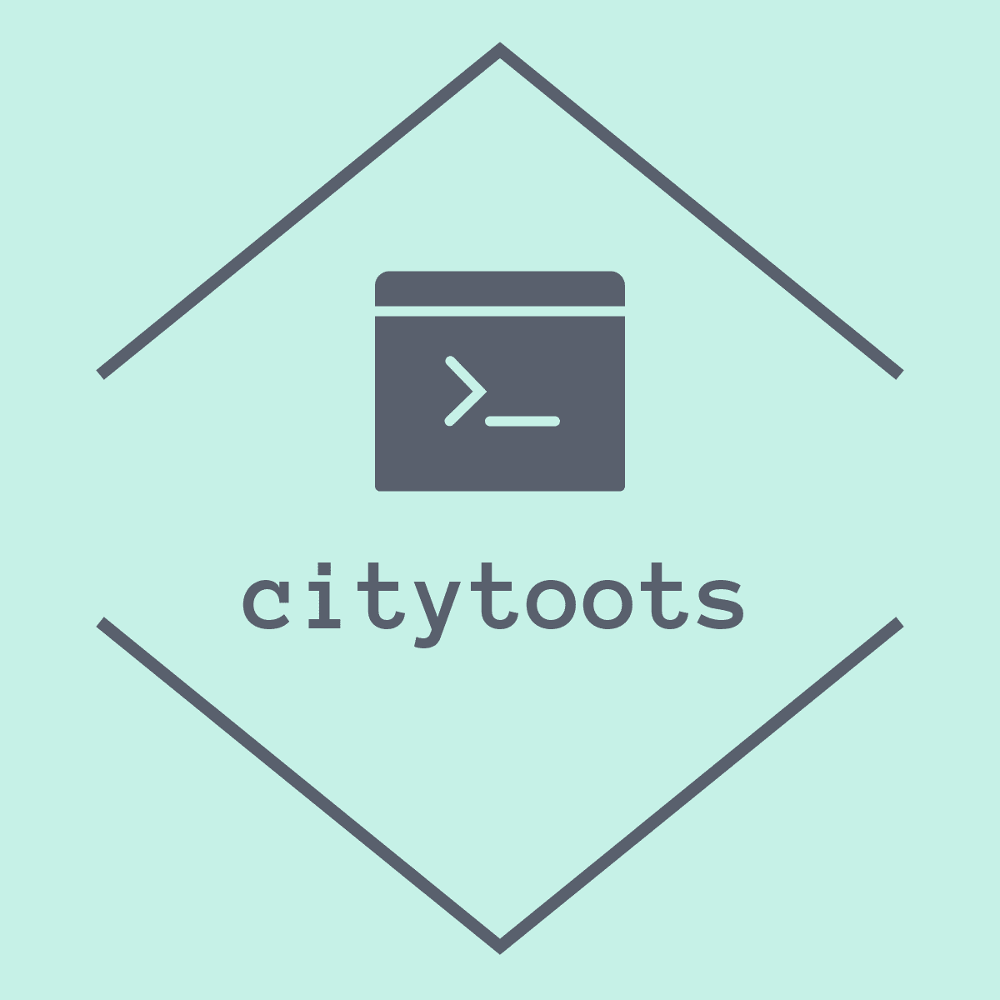

# citytweets/citytoots

 

 

## About

citytweets is a Twitter and Mastodon repost bot currently powering my accounts listed below. In addition
to my accounts, it also powers [@TweetsFuerMiLB](https://twitter.com/TweetsFuerMiLB), which is not owned by me.

It reposts everything the search finds. It is intended to be used with searches like `@mindentweets` so that everyone
can at-mention the account `@mindentweets` and will get a repost, thus reach every follower of `@mindentweets`.

The bot's own Twitter account can be found at <a rel="me" href="https://twitter.com/citytweets_bot">
@citytweets_bot</a>.
The respective Mastodon account is hosted on <a rel="me" href="https://troet.cafe/@citytoots">
troet.cafe/@citytoots</a>[^1].

## Tech

### Twitter

For some calls it still relies on the
deprecated [Twitter API 1.1](https://developer.twitter.com/en/docs/twitter-api/v1).
For calls to this API it uses [Twitter4J](https://github.com/Twitter4J/Twitter4J), which does not seem to be maintained
anymore as well.
For other calls, and especially the calls that actually search for new tweets, it already relies on the new
[Twitter API 2.0](https://developer.twitter.com/en/docs/twitter-api/early-access) to which I got early access. These
calls are made without any library help. Further migration will happen over time.

#### Twitter API Deprecation

On February 2nd 2023, Twitter announced the deprecation of their v1.1 and v2 APIs effective February 9th. 
<blockquote class="twitter-tweet">
Starting February 9, we will no longer support free access to the Twitter API, both v2 and v1.1. A paid basic tier will be available instead 🧵
&mdash; Twitter Dev (@TwitterDev) <a href="https://twitter.com/TwitterDev/status/1621026986784337922?ref_src=twsrc%5Etfw">February 2, 2023</a></blockquote>

These are the two APIs citytweets relies on to work for Twitter, so unless Twitter changes that policy, any Twitter 
retweet account will stop working on that date.

### Mastodon

The important parts of the [Mastodon API](https://docs.joinmastodon.org/api/) are implemented. It currently still relies 
on parsing its followers' toots and reposting those in case there is a mention, instead of using the search including 
webfinger lookup.

## Owned Accounts

| **Platform** | **Handle**       | **Name**              | **Link**                                                                                 | **Status**               |
|--------------|------------------|-----------------------|------------------------------------------------------------------------------------------|--------------------------|
| Twitter      | @mindentweets    | Minden Tweets         | <a rel="me" href="https://twitter.com/mindentweets"> twitter.com/mindentweets </a>       | Active                   |
| Twitter      | @luebbecketweets | Lübbecke Tweets       | <a rel="me" href="https://twitter.com/luebbecketweets"> twitter.com/luebbecketweets </a> | Active                   |
| Twitter      | @herfordtweets   | Herford Tweets        | <a rel="me" href="https://twitter.com/herfordtweets"> twitter.com/herfordtweets </a>     | Active                   |
| Twitter      | @badoeyntweets   | Bad Oeynhausen Tweets | <a rel="me" href="https://twitter.com/badoeyntweets"> twitter.com/badoeyntweets </a>     | Active                   |
| Twitter      | @espelkamptweets | Espelkamp Tweets      | <a rel="me" href="https://twitter.com/espelkamptweets"> twitter.com/espelkamptweets </a> | Active                   |
| Twitter      | @portatweets     | Porta Tweets          | <a rel="me" href="https://twitter.com/portatweets"> twitter.com/portatweets </a>         | Inactive, profile exists |
| Twitter      | @hilletweets     | Hille Tweets          | <a rel="me" href="https://twitter.com/hilletweets"> twitter.com/hilletweets </a>         | Inactive, profile exists |
| Twitter      | @rahdentweets    | Rahden Tweets         | <a rel="me" href="https://twitter.com/rahdentweets"> twitter.com/rahdentweets </a>       | Inactive, profile exists |
| Mastodon     | @mindentoots     | Minden Toots          | <a rel="me" href="https://nrw.social/@mindentoots"> nrw.social/@mindentoots </a>         | Inactive, profile exists |
| Mastodon     | @luebbecketoots  | Lübbecke Toots        | <a rel="me" href="https://nrw.social/@luebbecketoots"> nrw.social/@luebbecketoots </a>   | Inactive, profile exists |
| Mastodon     | @herfordtoots    | Herford Toots         | <a rel="me" href="https://nrw.social/@herfordtoots"> nrw.social/@herfordtoots </a>       | Inactive, profile exists |
| Mastodon     | @badoeyntoots    | Bad Oeynhausen Toots  | <a rel="me" href="https://nrw.social/@badoeyntoots"> nrw.social/@badoeyntoots </a>       | Inactive, profile exists |
| Mastodon     | @espelkamptoots  | Espelkamp Toots       | <a rel="me" href="https://nrw.social/@espelkamptoots"> nrw.social/@espelkamptoots </a>   | Inactive, profile exists |
| Mastodon     | @portatoots      | Porta Toots           | <a rel="me" href="https://nrw.social/@portatoots"> nrw.social/@portatoots </a>           | Inactive, profile exists |
| Mastodon     | @hilletoots      | Hille Toots           | <a rel="me" href="https://nrw.social/@hilletoots"> nrw.social/@hilletoots </a>           | Inactive, profile exists |
| Mastodon     | @rahdentoots     | Rahden Toots          | <a rel="me" href="https://nrw.social/@rahdentoots"> nrw.social/@rahdentoots </a>         | Inactive, profile exists |
| Mastodon     | @milktoots       | Minden-Lübbecke Toots | <a rel="me" href="https://nrw.social/@milktoots"> nrw.social/@milktoots </a>             | Inactive, profile exists |

[^1]: It was originally hosted on <a rel="me" href="https://fosstodon.org/@citytoots">
fosstodon.org/@citytoots</a> but had to be moved, as [fosstodon.org](https://fosstodon.org)'s 
[Code Of Conduct](https://hub.fosstodon.org/coc/) does not allow posts in German language.
