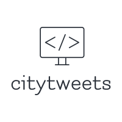

 # citytweets
 

 

## About
citytweets is a Twitter retweet bot currently powering my accounts listed below. In addition 
to my accounts, it also powers [@TweetsFuerMiLB](https://twitter.com/TweetsFuerMiLB), which is not owned by me.

It retweets everything the search finds. It is intended to be used with searches like `@mindentweets` so that everyone 
can at-mention the account `@mindentweets` and will get a retweet, thus reach every follower of `@mindentweets`.

The bot's own Twitter account can be found at <a rel="me" href="https://twitter.com/citytweets_bot"> @citytweets_bot </a>. 
The respective Mastodon account is hosted on <a rel="me" href="https://fosstodon.org/@citytoots">fosstodon.org/@citytoots</a>.

## Tech

### Twitter
For some calls it still relies on the deprecated [Twitter API 1.1](https://developer.twitter.com/en/docs/twitter-api/v1). 
For calls to this API it uses [Twitter4J](https://github.com/Twitter4J/Twitter4J), which does not seem to be maintained anymore as well.
For other calls, and especially the calls that actually search for new tweets, it already relies on the new
[Twitter API 2.0](https://developer.twitter.com/en/docs/twitter-api/early-access) to which I got early access. These 
calls are made without any library help. Further migration will happen over time.

### Mastodon
The important parts of the [Mastodon API](https://docs.joinmastodon.org/api/) are implemented. Unfortunately, currently the Mastodon API doesn't allow for boosts via the API without manual user approval for every boost, so until further notice I won't be able to finish the Mastodon side of the bot.

## Owned Accounts

| **Platform** | **Handle**       | **Name**              | **Link**                                                                                 | **Status**                |
|--------------|------------------|-----------------------|------------------------------------------------------------------------------------------|---------------------------|
| Twitter      | @mindentweets    | Minden Tweets         | <a rel="me" href="https://twitter.com/mindentweets"> twitter.com/mindentweets </a>       | Active                     |
| Twitter      | @luebbecketweets | Lübbecke Tweets       | <a rel="me" href="https://twitter.com/luebbecketweets"> twitter.com/luebbecketweets </a> | Active                     |
| Twitter      | @herfordtweets   | Herford Tweets        | <a rel="me" href="https://twitter.com/herfordtweets"> twitter.com/herfordtweets </a>     | Active                     |
| Twitter      | @badoeyntweets   | Bad Oeynhausen Tweets | <a rel="me" href="https://twitter.com/badoeyntweets"> twitter.com/badoeyntweets </a>     | Active                     |
| Twitter      | @espelkamptweets | Espelkamp Tweets      | <a rel="me" href="https://twitter.com/espelkamptweets"> twitter.com/espelkamptweets </a> | Active                     |
| Twitter      | @portatweets     | Porta Tweets          | <a rel="me" href="https://twitter.com/portatweets"> twitter.com/portatweets </a>         | Inactive, profile exists |
| Twitter      | @hilletweets     | Hille Tweets          | <a rel="me" href="https://twitter.com/hilletweets"> twitter.com/hilletweets </a>         | Inactive, profile exists |
| Twitter      | @rahdentweets    | Rahden Tweets         | <a rel="me" href="https://twitter.com/rahdentweets"> twitter.com/rahdentweets </a>       | Inactive, profile exists |
| Mastodon     | @mindentoots     | Minden Toots          | <a rel="me" href="https://nrw.social/@mindentoots"> nrw.social/@mindentoots </a>         | Inactive, profile exists |
| Mastodon     | @luebbecketoots  | Lübbecke Toots        | <a rel="me" href="https://nrw.social/@luebbecketoots"> nrw.social/@luebbecketoots </a>   | Inactive, profile exists |
| Mastodon     | @herfordtoots    | Herford Toots         | <a rel="me" href="https://nrw.social/@herfordtoots"> nrw.social/@herfordtoots </a>       | Inactive, profile exists |
| Mastodon     | @badoeyntoots    | Bad Oeynhausen Toots  | <a rel="me" href="https://nrw.social/@badoeyntoots"> nrw.social/@badoeyntoots </a>       | Inactive, profile exists |
| Mastodon     | @espelkamptoots  | Espelkamp Toots       | <a rel="me" href="https://nrw.social/@espelkamptoots"> nrw.social/@espelkamptoots </a>   | Inactive, profile exists |
| Mastodon     | @portatoots      | Porta Toots           | <a rel="me" href="https://nrw.social/@portatoots"> nrw.social/@portatoots </a>           | Inactive, profile exists |
| Mastodon     | @hilletoots      | Hille Toots           | <a rel="me" href="https://nrw.social/@hilletoots"> nrw.social/@hilletoots </a>           | Inactive, profile exists |
| Mastodon     | @rahdentoots     | Rahden Toots          | <a rel="me" href="https://nrw.social/@rahdentoots"> nrw.social/@rahdentoots </a>         | Inactive, profile exists |
